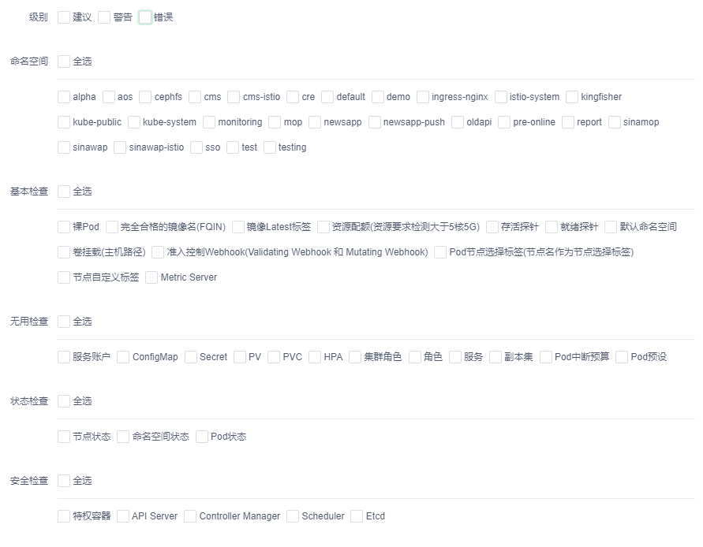

# Kingfisher Inspect

对Kubernetes集群进行健康扫描，以图表的方式进行展示

## 现有检查项目

## 依赖

- Golang： `Go >= 1.13`

## 说明

- 安全审查基于[CIS](https://www.cisecurity.org/cis-benchmarks/) Kubernetes_Benchmark_v1.5.0
- 借鉴项目 [clusterlint](https://github.com/digitalocean/clusterlint)

## Makefile的使用

- 根据需求修改对应的REGISTRY变量，即可修改推送的仓库地址
- 编译成二进制文件： make build
- 生成镜像推送到镜像仓库： make push

